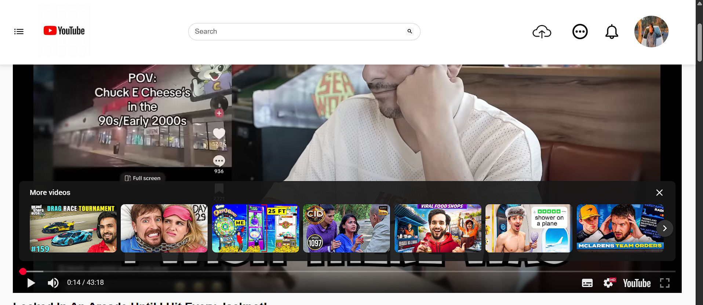

# React + Vite

Overview

This project is a YouTube Clone built using React and Vite, mimicking the core functionality and UI of YouTube.
It allows users to browse videos, view details, and navigate through a responsive interface.

🚀 Live Link

Check out the live project here: [  https://clone-app643.web.app/  ]

🛠 Tech Stack

Frontend: React, Vite

Styling: CSS, Tailwind / Bootstrap (if used)

Hosting: Firebase Hosting

APIs: YouTube API (if integrated for data)

📸 Screenshots

Home Page 

Description:
The Home Page showcases trending videos, recommended content, and categories. Users can scroll through video thumbnails, see video titles, and quickly navigate to their favorite content. The search bar allows users to find specific videos seamlessly.

Video Page

Description:
The Video Page lets users watch a selected video with player controls, video description, and related videos suggested on the sidebar. Users can also like/dislike videos and explore more content from the same channel.

Dashboard Page 

Description:
The Dashboard provides users with an overview of their account, including saved videos, history, and preferences. It’s a centralized hub for managing personal content and settings within the app.

Search Feature

⚡ Features

Responsive design for desktop and mobile

Search for videos

Video playback

Navigation between video categories

Modern React + Vite setup

📝 Installation & Setup

Clone the repository:

[git clone https://github.com/Sonali-jai/ReactYoutube_Clone.git]

Navigate to the project folder:

cd ReactYoutube_Clone

Install dependencies:

[npm install]

Run the development server:

[npm run dev]

Build for production:

[npm run build]

Deploy to Firebase (optional if you want to redeploy):

firebase deploy

🤝 Contributing

Fork the repository

Create a branch for your feature

[git checkout -b feature/your-feature]

Commit your changes

git commit -m "Add new feature"

Push to the branch

[git push origin feature/your-feature]

Create a Pull Request

📄 License

This project is licensed under the MIT License.

This template provides a minimal setup to get React working in Vite with HMR and some ESLint rules.

Currently, two official plugins are available:

- [@vitejs/plugin-react](https://github.com/vitejs/vite-plugin-react/blob/main/packages/plugin-react/README.md) uses [Babel](https://babeljs.io/) for Fast Refresh
- [@vitejs/plugin-react-swc](https://github.com/vitejs/vite-plugin-react-swc) uses [SWC](https://swc.rs/) for Fast Refresh
